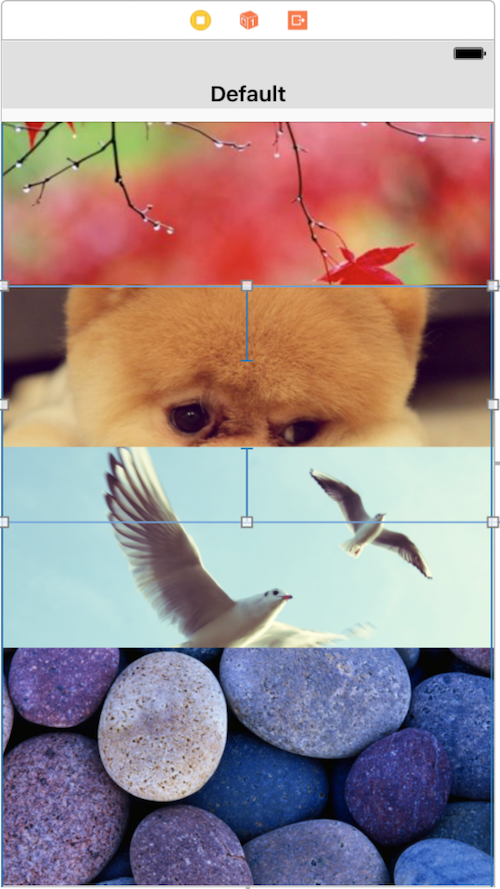
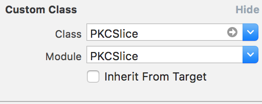
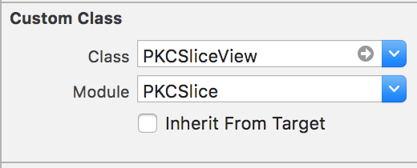
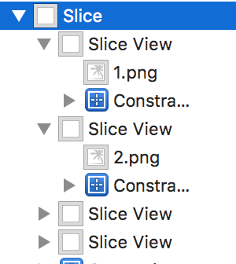
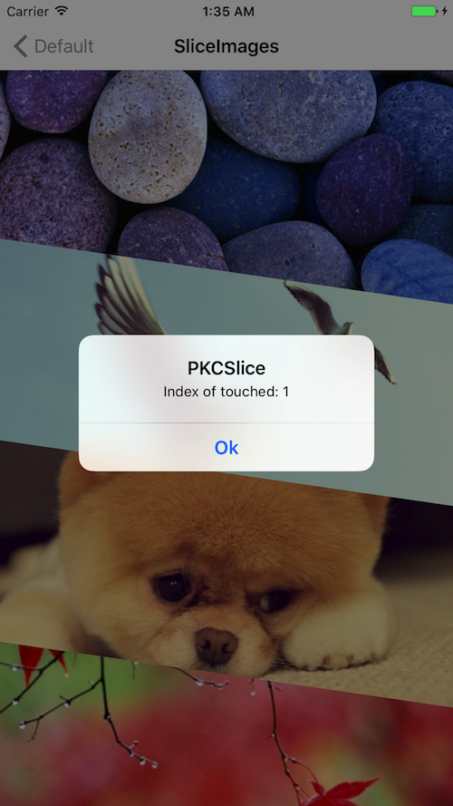

# PKCSlice


[](http://cocoapods.org/pods/PKCSlice)
[](http://cocoapods.org/pods/PKCSlice)
[](http://cocoapods.org/pods/PKCSlice)

## Example

To run the example project, clone the repo, and run `pod install` from the Example directory first.

#### use storyboard










~~~~

@IBOutlet weak var sliceView: PKCSlice!

self.sliceView.delegate = self
//self.sliceView.autoSlice(false)


extension ViewController: PKCSliceDelegate{
    func pkcSliceTouch(_ index: Int) {
        
    }
}

~~~~

<br><br><br><br><br><br>

#### use code


~~~~

var images = [UIImage]()
images.append(UIImage(named: "4.png")!)
images.append(UIImage(named: "3.png")!)
images.append(UIImage(named: "2.png")!)
images.append(UIImage(named: "1.png")!)
let sliceView = PKCSlice(self.superView, sliceImages: images)

~~~~


<br><br><br><br><br><br>

#### touch Delegate





~~~~~

public protocol PKCSliceDelegate {
    func pkcSliceTouch(_ index: Int)
}

~~~~~


## Requirements

## Installation

PKCSlice is available through [CocoaPods](http://cocoapods.org). To install
it, simply add the following line to your Podfile:

```ruby
pod "PKCSlice"
```

## Author

pikachu987, pikachu77769@gmail.com

## License

PKCSlice is available under the MIT license. See the LICENSE file for more info.
