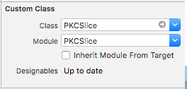
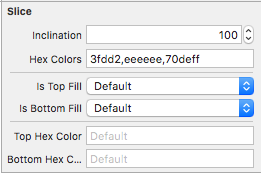
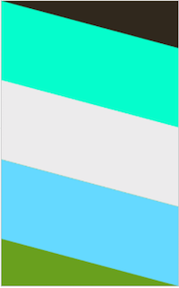

# PKCSlice


[](http://cocoapods.org/pods/PKCSlice)
[](http://cocoapods.org/pods/PKCSlice)
[](http://cocoapods.org/pods/PKCSlice)
[](https://developer.apple.com/swift/)

## Introduce

The view can be slanted and added dynamically.
You may or may not fill the top and bottom views.


## Requirements

`PKCSlice` written in Swift 4. Compatible with iOS 8.0+

## Installation

### Cocoapods

Tags is available through [CocoaPods](http://cocoapods.org). To install
it, simply add the following line to your Podfile:

```ruby
pod 'PKCSlice'
```

## Usage


### Xib or Storyboard file

setting





view

 

done!

<br><br><br>

### Code editor

```swift
import PKCSlice
```

```swift
let sliceView = PKCSlice()
self.view.addSubview(sliceView)
```
AutoLayout Example

```swift
sliceView.translatesAutoresizingMaskIntoConstraints = false
self.view.addConstraint(NSLayoutConstraint(
  item: self.view,
  attribute: .leading,
  relatedBy: .equal,
  toItem: sliceView,
  attribute: .leading,
  multiplier: 1,
  constant: 0)
)
self.view.addConstraint(NSLayoutConstraint(
  item: self.view,
  attribute: .trailing,
  relatedBy: .equal,
  toItem: sliceView,
  attribute: .trailing,
  multiplier: 1,
  constant: 0)
)
self.view.addConstraint(NSLayoutConstraint(
  item: self.view,
  attribute: .top,
  relatedBy: .equal,
  toItem: sliceView,
  attribute: .top,
  multiplier: 1,
  constant: 0)
)
self.view.addConstraint(NSLayoutConstraint(
  item: self.view,
  attribute: .bottom,
  relatedBy: .equal,
  toItem: sliceView,
  attribute: .bottom,
  multiplier: 1,
  constant: 0)
)
```

done!

<br><br><br>


### Property

inclination

```swift
sliceView.inclination = 100
```

sliceView

```swift
// Returned as an array of PKCSliceView
sliceView.sliceViewArray//get-only

// Make Array in colors
sliceView.hexColors = "e2e2e2,000000"

// SliceView Fill top
sliceView.isTopFill = true

// SliceView Fill bottom
sliceView.isBottomFill = true

// topSliceView
sliceView.topSliceView = PKCSliceView()

// bottomSliceView
sliceView.bottomSliceView = PKCSliceView()

// Make Simply topSliceView
sliceView.topHexColor = "e2e2e2"

// Make Simply bottomSliceView
sliceView.bottomHexColor = "e2e2e2"
```


<br><br>

### Method

append

```swift
sliceView.append(PKCSliceView())
sliceView.append(contentsOf: [PKCSliceView(), PKCSliceView()])
```

remove

```swift
sliceView.removeAll()
```

redraw

```swift
// ReDraw
sliceView.redraw()
```

<br><br>

### Delegate

```swift
class ViewController: UIViewController{
    override func viewDidLoad() {
        super.viewDidLoad()
        
        let sliceView = PKCSlice()
        sliceView.delegate = self
    }
}

extension ViewController: SliceViewDelegate{

    // sliceView Touch
    func sliceTouchAction(_ slice: PKCSlice, sliceView: PKCSliceView, index: Int) {
    
    }
    
    // sliceTopView Touch
    func sliceTopTouchAction(_ slice: PKCSlice, sliceView: PKCSliceView) {
    
    }
    
    // sliceBottomView Touch
    func sliceBottomTouchAction(_ slice: PKCSlice, sliceView: PKCSliceView) {
    
    }
}

```

<br><br>

### Customize

PKCSliceView Customize

MAKE CustomSliceView.xib &

```swift
import UIKit
import PKCSlice

class CustomSliceView: PKCSliceView {
    @IBOutlet private weak var imageView1: UIImageView!
    @IBOutlet private weak var imageView2: UIImageView!
    
    override func awakeFromNib() {
        super.awakeFromNib()
        self.imageView1.contentMode = .scaleAspectFill
        self.imageView2.contentMode = .scaleAspectFill
        self.imageView1.clipsToBounds = true
        self.imageView2.clipsToBounds = true
        self.imageView1.image = UIImage(named: "1.png")
        self.imageView2.image = UIImage(named: "2.png")
    }
}
```

```swift
guard let sliceView = Bundle.main.loadNibNamed("CustomSliceView", owner: self, options: nil)?.first as? CustomSliceView else{ return }
self.sliceView.append(sliceView)

```


## Author

pikachu987, pikachu77769@gmail.com

## License

Tags is available under the MIT license. See the LICENSE file for more info.
